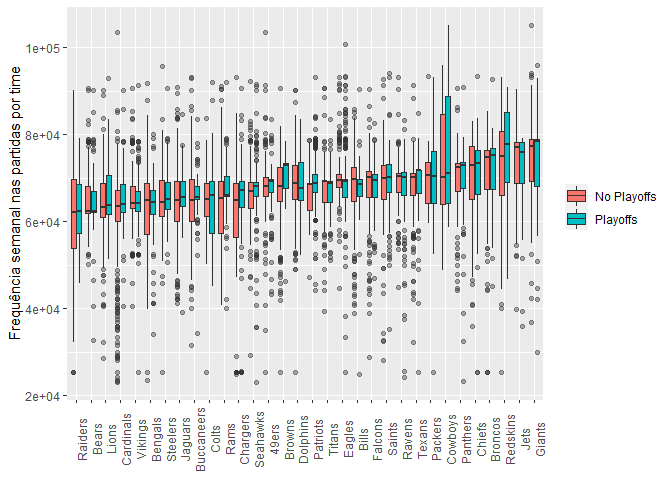
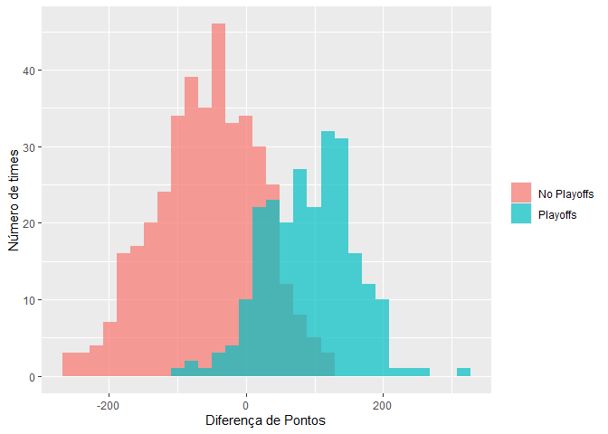
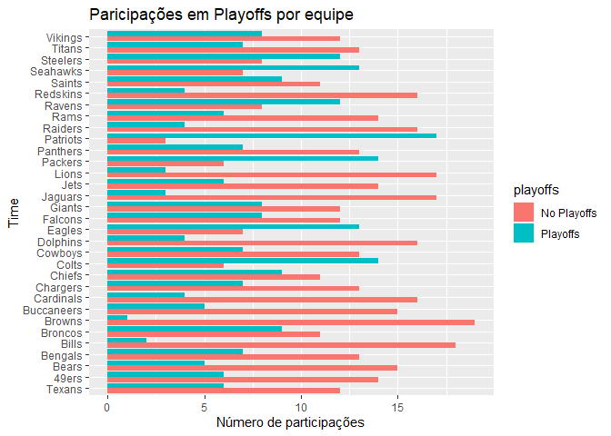
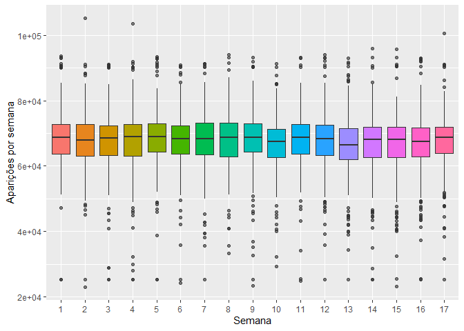
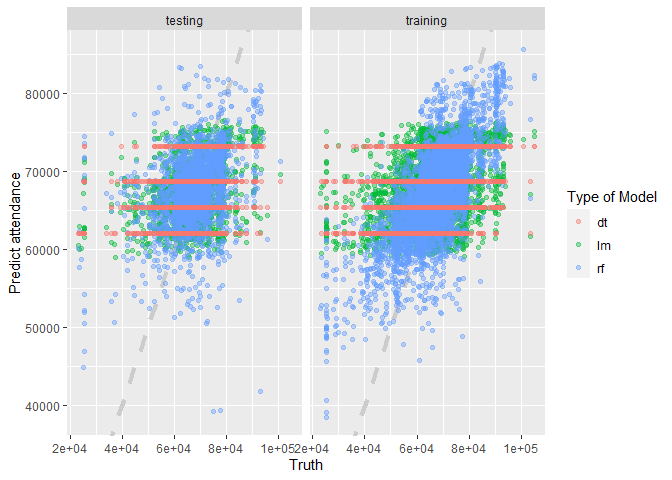
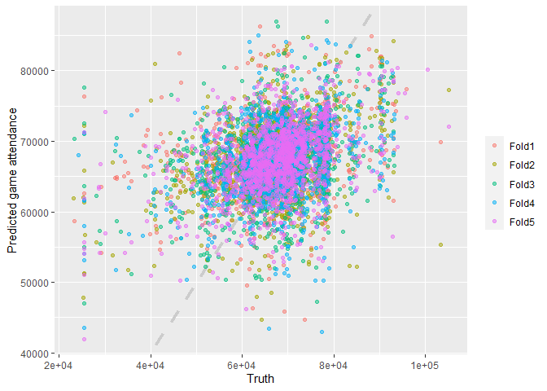

Por que usar a validação cruzada?
================
Carlos Eduardo Cardoso
08/05/2021

# VALIDAÇÃO CRUZADA

Vamos conversar um pouco sobre a importância da reamostragem no processo
de construção de um modelo de machine learning. Começaremos carregando e
analisando de forma rápida a base de dados a ser utilizada.

``` r
# Carregando os dados -----------------------------------------------------

library(tidyverse)

attendance <- read_csv("https://raw.githubusercontent.com/rfordatascience/tidytuesday/master/data/2020/2020-02-04/attendance.csv")
standings <- read_csv("https://raw.githubusercontent.com/rfordatascience/tidytuesday/master/data/2020/2020-02-04/standings.csv")
head(attendance)
```

    ## # A tibble: 6 x 8
    ##   team    team_name  year  total   home   away  week weekly_attendance
    ##   <chr>   <chr>     <dbl>  <dbl>  <dbl>  <dbl> <dbl>             <dbl>
    ## 1 Arizona Cardinals  2000 893926 387475 506451     1             77434
    ## 2 Arizona Cardinals  2000 893926 387475 506451     2             66009
    ## 3 Arizona Cardinals  2000 893926 387475 506451     3                NA
    ## 4 Arizona Cardinals  2000 893926 387475 506451     4             71801
    ## 5 Arizona Cardinals  2000 893926 387475 506451     5             66985
    ## 6 Arizona Cardinals  2000 893926 387475 506451     6             44296

``` r
knitr::kable(attendance[1:6,], 'markdown')
```

| team    | team\_name | year |  total |   home |   away | week | weekly\_attendance |
|:--------|:-----------|-----:|-------:|-------:|-------:|-----:|-------------------:|
| Arizona | Cardinals  | 2000 | 893926 | 387475 | 506451 |    1 |              77434 |
| Arizona | Cardinals  | 2000 | 893926 | 387475 | 506451 |    2 |              66009 |
| Arizona | Cardinals  | 2000 | 893926 | 387475 | 506451 |    3 |                 NA |
| Arizona | Cardinals  | 2000 | 893926 | 387475 | 506451 |    4 |              71801 |
| Arizona | Cardinals  | 2000 | 893926 | 387475 | 506451 |    5 |              66985 |
| Arizona | Cardinals  | 2000 | 893926 | 387475 | 506451 |    6 |              44296 |

``` r
knitr::kable(standings[1:6,], 'markdown')
```

| team         | team\_name | year | wins | loss | points\_for | points\_against | points\_differential | margin\_of\_victory | strength\_of\_schedule | simple\_rating | offensive\_ranking | defensive\_ranking | playoffs    | sb\_winner   |
|:-------------|:-----------|-----:|-----:|-----:|------------:|----------------:|---------------------:|--------------------:|-----------------------:|---------------:|-------------------:|-------------------:|:------------|:-------------|
| Miami        | Dolphins   | 2000 |   11 |    5 |         323 |             226 |                   97 |                 6.1 |                    1.0 |            7.1 |                0.0 |                7.1 | Playoffs    | No Superbowl |
| Indianapolis | Colts      | 2000 |   10 |    6 |         429 |             326 |                  103 |                 6.4 |                    1.5 |            7.9 |                7.1 |                0.8 | Playoffs    | No Superbowl |
| New York     | Jets       | 2000 |    9 |    7 |         321 |             321 |                    0 |                 0.0 |                    3.5 |            3.5 |                1.4 |                2.2 | No Playoffs | No Superbowl |
| Buffalo      | Bills      | 2000 |    8 |    8 |         315 |             350 |                  -35 |                -2.2 |                    2.2 |            0.0 |                0.5 |               -0.5 | No Playoffs | No Superbowl |
| New England  | Patriots   | 2000 |    5 |   11 |         276 |             338 |                  -62 |                -3.9 |                    1.4 |           -2.5 |               -2.7 |                0.2 | No Playoffs | No Superbowl |
| Tennessee    | Titans     | 2000 |   13 |    3 |         346 |             191 |                  155 |                 9.7 |                   -1.3 |            8.3 |                1.5 |                6.8 | Playoffs    | No Superbowl |

Os dados aqui utilizados fazem parte do projeto \#TidyTuesday onde
semanalmente são disponibilizados dados brutos com o intuito de serem
explorados e compartilhados por toda a comunidade R. Para mais detalhes,
vale a pena dar um olhada em
<https://github.com/rfordatascience/tidytuesday>.

A base contém registros dos times profissionais da NFL, com informações
sobre o nome do time, a cidade, o ano da temporada, se o jogo foi dentro
ou fora de casa, número de aparições, pontos a favor, contra, entre
outras informações divididas em 2 arquivos (*attendance* e *standings*).
O dicionário de dados pode ser acessado em
<https://github.com/rfordatascience/tidytuesday/tree/master/data/2020/2020-02-04#data-dictionary>.

Vamos agrupar as duas bases para realizar as análises iniciais

``` r
# agrupando os dados ------------------------------------------------------

attendace_unique = attendance%>%
  left_join(standings, by=c('year', 'team_name', 'team'))

knitr::kable(attendace_unique[1:6,], 'markdown')
```

| team    | team\_name | year |  total |   home |   away | week | weekly\_attendance | wins | loss | points\_for | points\_against | points\_differential | margin\_of\_victory | strength\_of\_schedule | simple\_rating | offensive\_ranking | defensive\_ranking | playoffs    | sb\_winner   |
|:--------|:-----------|-----:|-------:|-------:|-------:|-----:|-------------------:|-----:|-----:|------------:|----------------:|---------------------:|--------------------:|-----------------------:|---------------:|-------------------:|-------------------:|:------------|:-------------|
| Arizona | Cardinals  | 2000 | 893926 | 387475 | 506451 |    1 |              77434 |    3 |   13 |         210 |             443 |                 -233 |               -14.6 |                   -0.7 |          -15.2 |               -7.2 |               -8.1 | No Playoffs | No Superbowl |
| Arizona | Cardinals  | 2000 | 893926 | 387475 | 506451 |    2 |              66009 |    3 |   13 |         210 |             443 |                 -233 |               -14.6 |                   -0.7 |          -15.2 |               -7.2 |               -8.1 | No Playoffs | No Superbowl |
| Arizona | Cardinals  | 2000 | 893926 | 387475 | 506451 |    3 |                 NA |    3 |   13 |         210 |             443 |                 -233 |               -14.6 |                   -0.7 |          -15.2 |               -7.2 |               -8.1 | No Playoffs | No Superbowl |
| Arizona | Cardinals  | 2000 | 893926 | 387475 | 506451 |    4 |              71801 |    3 |   13 |         210 |             443 |                 -233 |               -14.6 |                   -0.7 |          -15.2 |               -7.2 |               -8.1 | No Playoffs | No Superbowl |
| Arizona | Cardinals  | 2000 | 893926 | 387475 | 506451 |    5 |              66985 |    3 |   13 |         210 |             443 |                 -233 |               -14.6 |                   -0.7 |          -15.2 |               -7.2 |               -8.1 | No Playoffs | No Superbowl |
| Arizona | Cardinals  | 2000 | 893926 | 387475 | 506451 |    6 |              44296 |    3 |   13 |         210 |             443 |                 -233 |               -14.6 |                   -0.7 |          -15.2 |               -7.2 |               -8.1 | No Playoffs | No Superbowl |

## Análise Descritiva Inicial

``` r
library(skimr)
glimpse(attendace_unique)
```

    ## Rows: 10,846
    ## Columns: 20
    ## $ team                 <chr> "Arizona", "Arizona", "Arizona", "Arizona", "Ariz~
    ## $ team_name            <chr> "Cardinals", "Cardinals", "Cardinals", "Cardinals~
    ## $ year                 <dbl> 2000, 2000, 2000, 2000, 2000, 2000, 2000, 2000, 2~
    ## $ total                <dbl> 893926, 893926, 893926, 893926, 893926, 893926, 8~
    ## $ home                 <dbl> 387475, 387475, 387475, 387475, 387475, 387475, 3~
    ## $ away                 <dbl> 506451, 506451, 506451, 506451, 506451, 506451, 5~
    ## $ week                 <dbl> 1, 2, 3, 4, 5, 6, 7, 8, 9, 10, 11, 12, 13, 14, 15~
    ## $ weekly_attendance    <dbl> 77434, 66009, NA, 71801, 66985, 44296, 38293, 629~
    ## $ wins                 <dbl> 3, 3, 3, 3, 3, 3, 3, 3, 3, 3, 3, 3, 3, 3, 3, 3, 3~
    ## $ loss                 <dbl> 13, 13, 13, 13, 13, 13, 13, 13, 13, 13, 13, 13, 1~
    ## $ points_for           <dbl> 210, 210, 210, 210, 210, 210, 210, 210, 210, 210,~
    ## $ points_against       <dbl> 443, 443, 443, 443, 443, 443, 443, 443, 443, 443,~
    ## $ points_differential  <dbl> -233, -233, -233, -233, -233, -233, -233, -233, -~
    ## $ margin_of_victory    <dbl> -14.6, -14.6, -14.6, -14.6, -14.6, -14.6, -14.6, ~
    ## $ strength_of_schedule <dbl> -0.7, -0.7, -0.7, -0.7, -0.7, -0.7, -0.7, -0.7, -~
    ## $ simple_rating        <dbl> -15.2, -15.2, -15.2, -15.2, -15.2, -15.2, -15.2, ~
    ## $ offensive_ranking    <dbl> -7.2, -7.2, -7.2, -7.2, -7.2, -7.2, -7.2, -7.2, -~
    ## $ defensive_ranking    <dbl> -8.1, -8.1, -8.1, -8.1, -8.1, -8.1, -8.1, -8.1, -~
    ## $ playoffs             <chr> "No Playoffs", "No Playoffs", "No Playoffs", "No ~
    ## $ sb_winner            <chr> "No Superbowl", "No Superbowl", "No Superbowl", "~

``` r
skim(attendace_unique)
```

|                                                  |                   |
|:-------------------------------------------------|:------------------|
| Name                                             | attendace\_unique |
| Number of rows                                   | 10846             |
| Number of columns                                | 20                |
| \_\_\_\_\_\_\_\_\_\_\_\_\_\_\_\_\_\_\_\_\_\_\_   |                   |
| Column type frequency:                           |                   |
| character                                        | 4                 |
| numeric                                          | 16                |
| \_\_\_\_\_\_\_\_\_\_\_\_\_\_\_\_\_\_\_\_\_\_\_\_ |                   |
| Group variables                                  | None              |

Data summary

**Variable type: character**

| skim\_variable | n\_missing | complete\_rate | min | max | empty | n\_unique | whitespace |
|:---------------|-----------:|---------------:|----:|----:|------:|----------:|-----------:|
| team           |          0 |              1 |   5 |  13 |     0 |        32 |          0 |
| team\_name     |          0 |              1 |   4 |  10 |     0 |        32 |          0 |
| playoffs       |          0 |              1 |   8 |  11 |     0 |         2 |          0 |
| sb\_winner     |          0 |              1 |  12 |  13 |     0 |         2 |          0 |

**Variable type: numeric**

| skim\_variable         | n\_missing | complete\_rate |       mean |       sd |       p0 |       p25 |       p50 |        p75 |      p100 | hist  |
|:-----------------------|-----------:|---------------:|-----------:|---------:|---------:|----------:|----------:|-----------:|----------:|:------|
| year                   |          0 |           1.00 |    2009.53 |     5.75 |   2000.0 |    2005.0 |    2010.0 |    2015.00 |    2019.0 | ▇▇▇▇▇ |
| total                  |          0 |           1.00 | 1080910.03 | 72876.97 | 760644.0 | 1040509.0 | 1081089.5 | 1123230.00 | 1322087.0 | ▁▁▇▆▁ |
| home                   |          0 |           1.00 |  540455.01 | 66774.65 | 202687.0 |  504360.0 |  543185.0 |  578342.00 |  741775.0 | ▁▁▅▇▁ |
| away                   |          0 |           1.00 |  540455.01 | 25509.33 | 450295.0 |  524974.0 |  541757.0 |  557741.00 |  601655.0 | ▁▂▇▇▂ |
| week                   |          0 |           1.00 |       9.00 |     4.90 |      1.0 |       5.0 |       9.0 |      13.00 |      17.0 | ▇▆▆▆▇ |
| weekly\_attendance     |        638 |           0.94 |   67556.88 |  9022.02 |  23127.0 |   63245.5 |   68334.0 |   72544.75 |  105121.0 | ▁▁▇▃▁ |
| wins                   |          0 |           1.00 |       7.98 |     3.08 |      0.0 |       6.0 |       8.0 |      10.00 |      16.0 | ▂▆▇▆▂ |
| loss                   |          0 |           1.00 |       7.98 |     3.08 |      0.0 |       6.0 |       8.0 |      10.00 |      16.0 | ▂▆▇▆▂ |
| points\_for            |          0 |           1.00 |     350.28 |    71.35 |    161.0 |     299.0 |     348.0 |     396.00 |     606.0 | ▂▇▇▂▁ |
| points\_against        |          0 |           1.00 |     350.28 |    59.50 |    165.0 |     310.0 |     347.0 |     392.00 |     517.0 | ▁▃▇▆▁ |
| points\_differential   |          0 |           1.00 |       0.00 |   101.01 |   -261.0 |     -75.0 |       1.5 |      73.00 |     315.0 | ▂▆▇▅▁ |
| margin\_of\_victory    |          0 |           1.00 |       0.00 |     6.32 |    -16.3 |      -4.7 |       0.1 |       4.60 |      19.7 | ▂▆▇▅▁ |
| strength\_of\_schedule |          0 |           1.00 |       0.00 |     1.63 |     -4.6 |      -1.1 |       0.0 |       1.20 |       4.3 | ▁▅▇▅▁ |
| simple\_rating         |          0 |           1.00 |       0.00 |     6.20 |    -17.4 |      -4.5 |       0.0 |       4.50 |      20.1 | ▁▆▇▅▁ |
| offensive\_ranking     |          0 |           1.00 |       0.00 |     4.34 |    -11.7 |      -3.2 |       0.0 |       2.70 |      15.9 | ▁▇▇▂▁ |
| defensive\_ranking     |          0 |           1.00 |       0.00 |     3.56 |     -9.8 |      -2.4 |       0.1 |       2.50 |       9.8 | ▁▅▇▅▁ |

Temos 10846 registros (linhas) com 20 características (colunas), sendo 4
do tipo *caracter* e 16 do tipo *numeric* de todos os times da NFL entre
2000 e 2019.

Uma das informações disponibilizadas, refere-se ao fato do time ter
participado ou não dos playoffs naquela temporada. Vamos olhar como a
frequência semanal (weekly\_attendance) nas partidas influencia na
participação nos playoffs usando o boxplot.

``` r
#  weekly_attendance - comportamento --------------------------------------

attendace_unique%>%
  filter(!is.na(weekly_attendance))%>%
  ggplot(aes(fct_reorder(team_name, weekly_attendance), weekly_attendance,
             fill=playoffs))+
  geom_boxplot(outlier.alpha = 0.4)+
  theme(axis.text.x = element_text(angle = 90))+
  labs(fill=NULL, x=NULL, y="Frequência semanal nas partidas por time")
```

<!-- -->

Todos os times contém registros da participação ou não nos playoffs,
sendo esse um fator que pode influenciar na nossa variável
*weekly\_attendance*. Em alguns casos é notória a influência da
participação nos playoffs.

No códido acima desconsideramos as linhas com *NA* na variável
analisada.

``` r
# points differential -------------------------------------------------------
#pontos marcados - pontos sofridos


attendace_unique%>%
  distinct(team_name, year, points_differential, playoffs)%>%
  ggplot(aes(points_differential, fill=playoffs))+
  geom_histogram(position = 'identity', alpha=0.7)+
  labs(x="Diferença de Pontos", y="Número de times", fill=NULL
       )
```

<!-- -->

Sobre a variável que registra a diferenca entre pontos marcados e pontos
sofridos, por temporada, podemos perceber uma diferença para os times
que chegam aos playoffs.

Sobre as participações no playoffs, por time:

``` r
attendace_unique%>%
  distinct(team_name, year, playoffs)%>%
  group_by(playoffs, team_name)%>%
  summarise(total = n())%>%
  ggplot(aes(x=fct_reorder(team_name, total), y=total, fill=playoffs))+
  geom_col(position = "dodge")+
  coord_flip()+
  labs(x="Time", y='Número de participações', title = 'Paricipações em Playoffs por equipe')
```

<!-- -->

Observando a distribuição do público por semana.

``` r
# Existe mudança com a semana? --------------------------------------------

attendace_unique%>%
  mutate(week = factor(week))%>%
  ggplot(aes(week, weekly_attendance, fill=week))+
  geom_boxplot(show.legend = F, outlier.alpha = 0.4)+
  labs(x="Semana", y= 'Aparições por semana')
```

<!-- -->

## Sobre o processo de modelagem:

Um boa modelagem começa com uma boa análise descritiva. Essa parte do
processo permite que você conheça bem os seus dados, seu comportamento e
permite a geração de insigths para a construção de um modelo
consistente. Apresentamos até aqui apenas algumas ideias de gráficos e
algumas hipóteses iniciais. É de extrema importância ter um bom
planejamento e foco sobre o que se pretende analisar, ou seja, que tipo
de pergunta pretende-se responder.

Nosso objetivo aqui é apresentar a importância de um bom processo de
reamostragem para a modelagem e como isso pode influenciar nos
resultados. Construiremos 3 modelos e analisaremos os resultados
utilizando duas formas de separação dos nossos dados para treino e
teste, buscando explicar com esses modelos a variável
*weekly\_attendance*.

``` r
# Retirando e filtrando os dados ------------------------------------------

attendance_final = attendace_unique%>%
  filter(! is.na(weekly_attendance))%>%
  select(
    weekly_attendance, team_name, year, week,
    margin_of_victory,strength_of_schedule, offensive_ranking, 
    defensive_ranking, playoffs)
knitr::kable(attendance_final[1:10,], 'markdown')
```

| weekly\_attendance | team\_name | year | week | margin\_of\_victory | strength\_of\_schedule | offensive\_ranking | defensive\_ranking | playoffs    |
|-------------------:|:-----------|-----:|-----:|--------------------:|-----------------------:|-------------------:|-------------------:|:------------|
|              77434 | Cardinals  | 2000 |    1 |               -14.6 |                   -0.7 |               -7.2 |               -8.1 | No Playoffs |
|              66009 | Cardinals  | 2000 |    2 |               -14.6 |                   -0.7 |               -7.2 |               -8.1 | No Playoffs |
|              71801 | Cardinals  | 2000 |    4 |               -14.6 |                   -0.7 |               -7.2 |               -8.1 | No Playoffs |
|              66985 | Cardinals  | 2000 |    5 |               -14.6 |                   -0.7 |               -7.2 |               -8.1 | No Playoffs |
|              44296 | Cardinals  | 2000 |    6 |               -14.6 |                   -0.7 |               -7.2 |               -8.1 | No Playoffs |
|              38293 | Cardinals  | 2000 |    7 |               -14.6 |                   -0.7 |               -7.2 |               -8.1 | No Playoffs |
|              62981 | Cardinals  | 2000 |    8 |               -14.6 |                   -0.7 |               -7.2 |               -8.1 | No Playoffs |
|              35286 | Cardinals  | 2000 |    9 |               -14.6 |                   -0.7 |               -7.2 |               -8.1 | No Playoffs |
|              52244 | Cardinals  | 2000 |   10 |               -14.6 |                   -0.7 |               -7.2 |               -8.1 | No Playoffs |
|              64223 | Cardinals  | 2000 |   11 |               -14.6 |                   -0.7 |               -7.2 |               -8.1 | No Playoffs |

Apenas para fins didáticos, selecionamos algumas variáveis que
consideramos essenciais para nosso modelo. ressalta-se que esse processo
de escolha é de extrema importância e existem técnicas estatísticas que
pode ser utilizadas mas que aqui foram omitidas por fugir do nosso
objetivo principal. Desconsideramos também as linhas com NA.

### Vamos aos modelos:

**Modelo 1: Regressão Linear (*lm\_fit*)**

**Modelo 2: Random Forest (*rf\_fit*)**

**Modelo 3: Árvore de decisão (*dt\_fit*)**

Para a construção dos modelos utilizaremos o *tidymodels*. Trata-se de
um framework extremamente poderoso que faz a junção de diversos pacotes
promovendo uma melhor integração no processo de modelagem. No código
abaixo, simplesmente dividiremos a base em treino e teste, aplicaremos o
modelo de regressão linear com o pacote *lm*, o modelo random forest com
o pacote *ranger* e o modelo de árvore de decisão com o pacote *rpart*,
especificamos a fórmula a ser utilizada para cada um, ou seja, qual é a
variável resposta (*weekly\_attendance*) e quais são as variáveis
explicativas.

``` r
# Modelagem ---------------------------------------------------------------

library(tidymodels)
set.seed(1234)

#divisão em treino e teste
attendance_split = attendance_final%>%
  initial_split(strata = playoffs )

nfl_train = training(attendance_split)
nfl_test = testing(attendance_split)


#especificação do modelo lm
lm_spec = linear_reg()%>%
  set_engine(engine = 'lm')

lm_spec
```

    ## Linear Regression Model Specification (regression)
    ## 
    ## Computational engine: lm

``` r
# fit do modelo linear
lm_fit = lm_spec%>%
  fit(weekly_attendance~.,
      data = nfl_train)
lm_fit
```

    ## parsnip model object
    ## 
    ## Fit time:  51ms 
    ## 
    ## Call:
    ## stats::lm(formula = weekly_attendance ~ ., data = data)
    ## 
    ## Coefficients:
    ##          (Intercept)        team_nameBears      team_nameBengals  
    ##            -80607.17              -2738.63              -4898.99  
    ##       team_nameBills      team_nameBroncos       team_nameBrowns  
    ##              -321.75               2741.19               -212.24  
    ##  team_nameBuccaneers    team_nameCardinals     team_nameChargers  
    ##             -3039.72              -6156.56              -6664.93  
    ##      team_nameChiefs        team_nameColts      team_nameCowboys  
    ##              1825.41              -3628.44               5963.38  
    ##    team_nameDolphins       team_nameEagles      team_nameFalcons  
    ##               185.79               1176.00               -275.61  
    ##      team_nameGiants      team_nameJaguars         team_nameJets  
    ##              5411.75              -3065.92               4091.77  
    ##       team_nameLions      team_namePackers     team_namePanthers  
    ##             -3685.38                939.39               1278.50  
    ##    team_namePatriots      team_nameRaiders         team_nameRams  
    ##              -298.62              -6415.92              -3056.86  
    ##      team_nameRavens     team_nameRedskins       team_nameSaints  
    ##              -324.32               6441.62                140.80  
    ##    team_nameSeahawks     team_nameSteelers       team_nameTexans  
    ##             -1446.69              -3561.54                211.05  
    ##      team_nameTitans      team_nameVikings                  year  
    ##             -1148.34              -3234.23                 74.49  
    ##                 week     margin_of_victory  strength_of_schedule  
    ##               -72.22               3323.40               3430.38  
    ##    offensive_ranking     defensive_ranking      playoffsPlayoffs  
    ##             -3151.09              -3237.09               -374.65

``` r
#especificação do rf
rf_spec = rand_forest(mode = 'regression')%>%
  set_engine('ranger')
rf_spec
```

    ## Random Forest Model Specification (regression)
    ## 
    ## Computational engine: ranger

``` r
#fit do modelo rf
rf_fit = rf_spec%>%
  fit(weekly_attendance~.,
      data = nfl_train)
rf_fit
```

    ## parsnip model object
    ## 
    ## Fit time:  2.4s 
    ## Ranger result
    ## 
    ## Call:
    ##  ranger::ranger(x = maybe_data_frame(x), y = y, num.threads = 1,      verbose = FALSE, seed = sample.int(10^5, 1)) 
    ## 
    ## Type:                             Regression 
    ## Number of trees:                  500 
    ## Sample size:                      7656 
    ## Number of independent variables:  8 
    ## Mtry:                             2 
    ## Target node size:                 5 
    ## Variable importance mode:         none 
    ## Splitrule:                        variance 
    ## OOB prediction error (MSE):       74372367 
    ## R squared (OOB):                  0.08666462

``` r
#especificação do modelo de árvore
dt_spec = decision_tree(mode = 'regression')%>%
  set_engine('rpart')
dt_spec
```

    ## Decision Tree Model Specification (regression)
    ## 
    ## Computational engine: rpart

``` r
#fit do modelo de árvore
dt_fit = dt_spec%>%
  fit(weekly_attendance~.,
      data = nfl_train)
dt_fit
```

    ## parsnip model object
    ## 
    ## Fit time:  90ms 
    ## n= 7656 
    ## 
    ## node), split, n, deviance, yval
    ##       * denotes terminal node
    ## 
    ## 1) root 7656 623342200000 67545.67  
    ##   2) team_name=Bears,Bengals,Buccaneers,Cardinals,Chargers,Colts,Jaguars,Lions,Raiders,Rams,Seahawks,Steelers,Titans,Vikings 3341 260566600000 64420.13  
    ##     4) team_name=Bengals,Cardinals,Chargers,Raiders 966 118867000000 62119.72 *
    ##     5) team_name=Bears,Buccaneers,Colts,Jaguars,Lions,Rams,Seahawks,Steelers,Titans,Vikings 2375 134508400000 65355.80 *
    ##   3) team_name=49ers,Bills,Broncos,Browns,Chiefs,Cowboys,Dolphins,Eagles,Falcons,Giants,Jets,Packers,Panthers,Patriots,Ravens,Redskins,Saints,Texans 4315 304866700000 69965.69  
    ##     6) team_name=49ers,Bills,Browns,Chiefs,Dolphins,Eagles,Falcons,Packers,Panthers,Patriots,Ravens,Saints,Texans 3101 171594600000 68701.30 *
    ##     7) team_name=Broncos,Cowboys,Giants,Jets,Redskins 1214 115651200000 73195.41 *

Por default, a função *initial\_split* inicia o processo de divisão da
base em treino e teste na proporção de *3/4* (75% para treino e 25% para
teste). Essa proporção pode ser alterada. Esse processo de divisão é
finalizado com as funções *training* e *testing*.

Construídos os modelos na base de treino, vamos avaliá-los. No código
abaixo avaliaremos os resultados tanto na base de treino, quanto na base
de teste para os três modelos construídos.

Inicialmente criaremos duas tibbles, uma para os dados de treino e outra
para os dados de teste, com uma coluna para os valores preditos por cada
modelo, outra coluna com o valor da base de dados e uma terceira coluna
com a especificação do modelo.

``` r
# Avaliando os modelos -----------------------------------------------------
set.seed(1234)
results_train = lm_fit%>%
  predict(new_data= nfl_train)%>%
  mutate(
    truth = nfl_train$weekly_attendance, model = 'lm')%>%
  bind_rows(rf_fit%>%
              predict(new_data = nfl_train)%>%
              mutate(
                truth = nfl_train$weekly_attendance, model='rf'))%>%
  bind_rows(dt_fit%>%
              predict(new_data = nfl_train)%>%
              mutate(
                truth = nfl_train$weekly_attendance, model = 'dt'))

results_test = lm_fit%>%
  predict(new_data=nfl_test)%>%
  mutate(
    truth = nfl_test$weekly_attendance, model = 'lm')%>%
  bind_rows(rf_fit%>%
              predict(new_data = nfl_test)%>%
              mutate(
                truth = nfl_test$weekly_attendance, model='rf'))%>%
  bind_rows(dt_fit%>%
              predict(new_data=nfl_test)%>%
              mutate(
                truth=nfl_test$weekly_attendance, model='dt'))
```

Vamos comparar cada um dos modelos construídos olhando para o *RMSE*

``` r
# Olhando para o RMSE -----------------------------------------------------
results_train%>%
  group_by(model)%>%
  rmse(truth=truth, estimate=.pred)
```

    ## # A tibble: 3 x 4
    ##   model .metric .estimator .estimate
    ##   <chr> <chr>   <chr>          <dbl>
    ## 1 dt    rmse    standard       8403.
    ## 2 lm    rmse    standard       8303.
    ## 3 rf    rmse    standard       6465.

``` r
results_test%>%
  group_by(model)%>%
  rmse(truth=truth, estimate=.pred)
```

    ## # A tibble: 3 x 4
    ##   model .metric .estimator .estimate
    ##   <chr> <chr>   <chr>          <dbl>
    ## 1 dt    rmse    standard       8450.
    ## 2 lm    rmse    standard       8351.
    ## 3 rf    rmse    standard       8560.

Nos dados de treino, podemos perceber que o modelo *random forest*
apresentou o menor *RMSE*, seguido da *regressão linear* e, por último,
a *árvore de decisão*. Já nos dados de teste, os resultados ficaram
relativamente próximos, com a *regressão linear* apresentando o melhor
desempenho (menor *RMSE*). Percebe-se um desempenho muito superior do
modelo de *random forest* nos dados de treino do que nos dados de teste.

``` r
#o modelo se comporta muito melhor no treino do que no teste
results_test%>%
  mutate(train = 'testing')%>%
  bind_rows(results_train%>%
              mutate(train='training'))%>%
  ggplot(aes(truth, .pred, color=model))+
  geom_abline(lty=2, color='gray80', size=1.5)+
  geom_point(alpha=0.4)+
  facet_wrap(~train)+
  labs(x='Truth', y="Predict attendance", color = 'Type of Model')
```

<!-- -->

Vamos avaliar os dados de treinamento utilizando a validação cruzada com
K=5

``` r
# Usando a validação cruzada ----------------------------------------------

set.seed(1234)

nfl_resamples = vfold_cv(nfl_train, v=5)

lm_res = fit_resamples(
  lm_spec,
  weekly_attendance ~.,
  nfl_resamples, 
  control = control_resamples(save_pred = T))

print("REGRESSÃO LINEAR")
```

    ## [1] "REGRESSÃO LINEAR"

``` r
collect_metrics(lm_res)
```

    ## # A tibble: 2 x 6
    ##   .metric .estimator     mean     n std_err .config             
    ##   <chr>   <chr>         <dbl> <int>   <dbl> <chr>               
    ## 1 rmse    standard   8353.        5 64.4    Preprocessor1_Model1
    ## 2 rsq     standard      0.145     5  0.0125 Preprocessor1_Model1

``` r
rf_res = fit_resamples(
  rf_spec,
  weekly_attendance ~ ., 
  nfl_resamples,
  control = control_resamples(save_pred = T))

print("RANDOM FOREST")
```

    ## [1] "RANDOM FOREST"

``` r
collect_metrics(rf_res)
```

    ## # A tibble: 2 x 6
    ##   .metric .estimator     mean     n std_err .config             
    ##   <chr>   <chr>         <dbl> <int>   <dbl> <chr>               
    ## 1 rmse    standard   8664.        5 79.2    Preprocessor1_Model1
    ## 2 rsq     standard      0.114     5  0.0142 Preprocessor1_Model1

``` r
dt_res = fit_resamples(
  dt_spec, 
  weekly_attendance ~ .,
  nfl_resamples,
  control=control_resamples(save_pred = T))

print("ÁRVORE DE DECISÃO")
```

    ## [1] "ÁRVORE DE DECISÃO"

``` r
collect_metrics(dt_res)
```

    ## # A tibble: 2 x 6
    ##   .metric .estimator     mean     n std_err .config             
    ##   <chr>   <chr>         <dbl> <int>   <dbl> <chr>               
    ## 1 rmse    standard   8431.        5 61.6    Preprocessor1_Model1
    ## 2 rsq     standard      0.128     5  0.0117 Preprocessor1_Model1

``` r
rf_res %>%
  unnest(.predictions) %>%
  ggplot(aes(weekly_attendance, .pred, color = id)) +
  geom_abline(lty = 2, color = "gray80", size = 1.5) +
  geom_point(alpha = 0.5) +
  labs(
    x = "Truth",
    y = "Predicted game attendance",
    color = NULL
  )
```

<!-- -->

Fazendo a validação cruzada, podemos perceber que o *RMSE*
especificamente para o modelo *random forest* se aproximou mais dos
valores de teste, diferente do que aconteceu quando a divisão na base de
treino foi realizada uma única vez (mesmo que de forma aleatória)

## CONCLUSÃO

O processo de validação cruzada nos permite entender nosso modelo de
forma mais ‘justa’, uma vez que ela realiza o procedimento de treino e
teste várias vezes dentro de um mesmo conjunto. Ao sortearmos uma única
vez os dados para construirmos nosso modelo, corremos o risco de, mesmo
que de forma aleatória, não considerar os valores que podem impactar nos
nossos resultados, fazendo com que as métricas avaliadas não nos
apresentem o que de fato está ocorrendo, como um valor muito baixo ou
muito alto, como aconteceu na nossa primeira modelagem.
