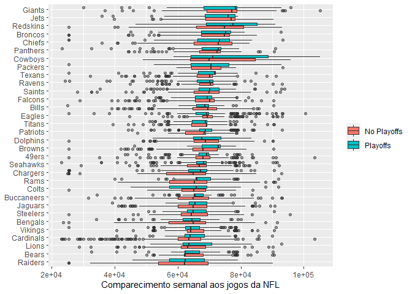
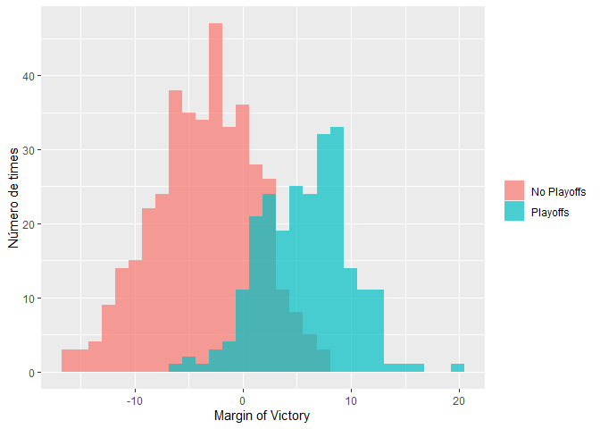
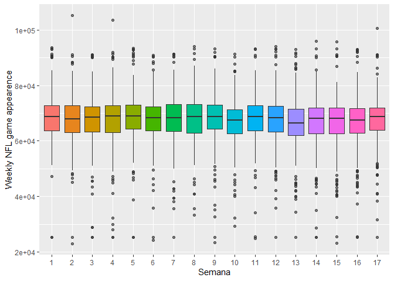
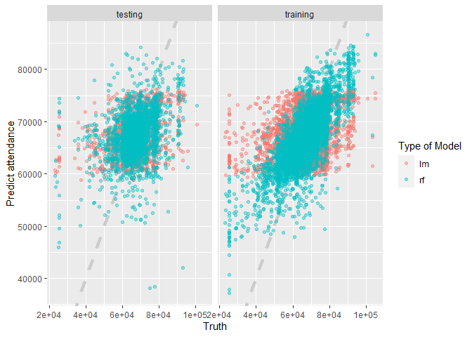
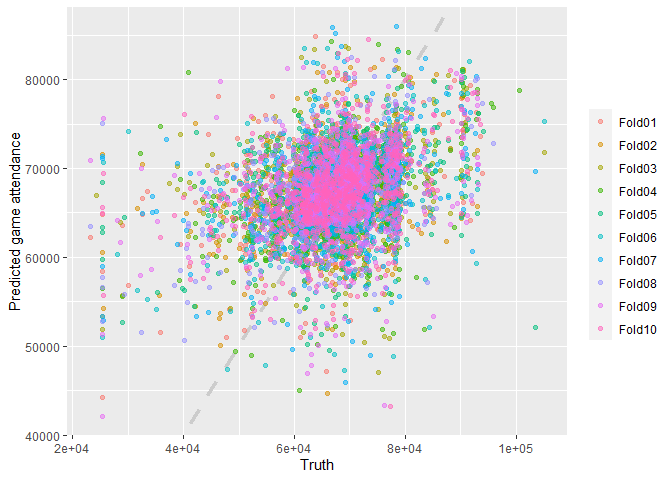

Por que usar a validação cruzada?
================
Carlos Eduardo Cardoso
08/05/2021

# VALIDAÇÃO CRUZADA

Vamos conversar um pouco sobre a importância da reamostragem no processo
de construção de um modelo de machine learning. Começaremos carregando e
analisando rapidamente a base de dados a ser utilizada.

``` r
# Carregando os dados -----------------------------------------------------

library(tidyverse)
```

    ## -- Attaching packages ---------------------------------- tidyverse 1.3.0.9000 --

    ## v ggplot2 3.3.3     v purrr   0.3.4
    ## v tibble  3.1.0     v dplyr   1.0.4
    ## v tidyr   1.1.2     v stringr 1.4.0
    ## v readr   1.4.0     v forcats 0.5.1

    ## -- Conflicts ------------------------------------------ tidyverse_conflicts() --
    ## x dplyr::filter() masks stats::filter()
    ## x dplyr::lag()    masks stats::lag()

``` r
attendance <- read_csv("https://raw.githubusercontent.com/rfordatascience/tidytuesday/master/data/2020/2020-02-04/attendance.csv")
```

    ## 
    ## -- Column specification --------------------------------------------------------
    ## cols(
    ##   team = col_character(),
    ##   team_name = col_character(),
    ##   year = col_double(),
    ##   total = col_double(),
    ##   home = col_double(),
    ##   away = col_double(),
    ##   week = col_double(),
    ##   weekly_attendance = col_double()
    ## )

``` r
standings <- read_csv("https://raw.githubusercontent.com/rfordatascience/tidytuesday/master/data/2020/2020-02-04/standings.csv")
```

    ## 
    ## -- Column specification --------------------------------------------------------
    ## cols(
    ##   team = col_character(),
    ##   team_name = col_character(),
    ##   year = col_double(),
    ##   wins = col_double(),
    ##   loss = col_double(),
    ##   points_for = col_double(),
    ##   points_against = col_double(),
    ##   points_differential = col_double(),
    ##   margin_of_victory = col_double(),
    ##   strength_of_schedule = col_double(),
    ##   simple_rating = col_double(),
    ##   offensive_ranking = col_double(),
    ##   defensive_ranking = col_double(),
    ##   playoffs = col_character(),
    ##   sb_winner = col_character()
    ## )

``` r
head(attendance)
```

    ## # A tibble: 6 x 8
    ##   team    team_name  year  total   home   away  week weekly_attendance
    ##   <chr>   <chr>     <dbl>  <dbl>  <dbl>  <dbl> <dbl>             <dbl>
    ## 1 Arizona Cardinals  2000 893926 387475 506451     1             77434
    ## 2 Arizona Cardinals  2000 893926 387475 506451     2             66009
    ## 3 Arizona Cardinals  2000 893926 387475 506451     3                NA
    ## 4 Arizona Cardinals  2000 893926 387475 506451     4             71801
    ## 5 Arizona Cardinals  2000 893926 387475 506451     5             66985
    ## 6 Arizona Cardinals  2000 893926 387475 506451     6             44296

``` r
# agrupando os dados ------------------------------------------------------

attendace_joined = attendance%>%
  left_join(standings, by=c('year', 'team_name', 'team'))

head(attendace_joined)
```

    ## # A tibble: 6 x 20
    ##   team   team_name  year  total   home   away  week weekly_attendan~  wins  loss
    ##   <chr>  <chr>     <dbl>  <dbl>  <dbl>  <dbl> <dbl>            <dbl> <dbl> <dbl>
    ## 1 Arizo~ Cardinals  2000 893926 387475 506451     1            77434     3    13
    ## 2 Arizo~ Cardinals  2000 893926 387475 506451     2            66009     3    13
    ## 3 Arizo~ Cardinals  2000 893926 387475 506451     3               NA     3    13
    ## 4 Arizo~ Cardinals  2000 893926 387475 506451     4            71801     3    13
    ## 5 Arizo~ Cardinals  2000 893926 387475 506451     5            66985     3    13
    ## 6 Arizo~ Cardinals  2000 893926 387475 506451     6            44296     3    13
    ## # ... with 10 more variables: points_for <dbl>, points_against <dbl>,
    ## #   points_differential <dbl>, margin_of_victory <dbl>,
    ## #   strength_of_schedule <dbl>, simple_rating <dbl>, offensive_ranking <dbl>,
    ## #   defensive_ranking <dbl>, playoffs <chr>, sb_winner <chr>

``` r
# Frequência semanal - comportamento --------------------------------------

attendace_joined%>%
  filter(!is.na(weekly_attendance))%>%
  ggplot(aes(fct_reorder(team_name, weekly_attendance), weekly_attendance,
             fill=playoffs))+
  geom_boxplot(outlier.alpha = 0.5)+
  coord_flip()+
  labs(fill=NULL, x=NULL, y="Comparecimento semanal aos jogos da NFL")
```

<!-- -->

``` r
# Margin_of_victory -------------------------------------------------------
#uma medida de pontos marcados em relação aos pontos permitidos


attendace_joined%>%
  distinct(team_name, year, margin_of_victory, playoffs)%>%
  ggplot(aes(margin_of_victory, fill=playoffs))+
  geom_histogram(position = 'identity', alpha=0.7)+
  labs(x="Margin of Victory", y="Número de times", fill=NULL
       )
```

    ## `stat_bin()` using `bins = 30`. Pick better value with `binwidth`.

<!-- -->

``` r
# Existe mudança com a semana? --------------------------------------------

attendace_joined%>%
  mutate(week = factor(week))%>%
  ggplot(aes(week, weekly_attendance, fill=week))+
  geom_boxplot(show.legend = F, outlier.alpha = 0.4)+
  labs(x="Semana", y= 'Weekly NFL game appearence')
```

    ## Warning: Removed 638 rows containing non-finite values (stat_boxplot).

<!-- -->

``` r
# Retirando e filtrando os dados ------------------------------------------

attendance_df = attendace_joined%>%
  filter(! is.na(weekly_attendance))%>%
  select(
    weekly_attendance, team_name, year, week, margin_of_victory,strength_of_schedule, playoffs
  )
head(attendance_df)
```

    ## # A tibble: 6 x 7
    ##   weekly_attendance team_name  year  week margin_of_victory strength_of_schedule
    ##               <dbl> <chr>     <dbl> <dbl>             <dbl>                <dbl>
    ## 1             77434 Cardinals  2000     1             -14.6                 -0.7
    ## 2             66009 Cardinals  2000     2             -14.6                 -0.7
    ## 3             71801 Cardinals  2000     4             -14.6                 -0.7
    ## 4             66985 Cardinals  2000     5             -14.6                 -0.7
    ## 5             44296 Cardinals  2000     6             -14.6                 -0.7
    ## 6             38293 Cardinals  2000     7             -14.6                 -0.7
    ## # ... with 1 more variable: playoffs <chr>

``` r
# Modelagem ---------------------------------------------------------------

library(tidymodels)
```

    ## -- Attaching packages -------------------------------------- tidymodels 0.1.2 --

    ## v broom     0.7.5      v recipes   0.1.15
    ## v dials     0.0.9      v rsample   0.0.9 
    ## v infer     0.5.4      v tune      0.1.3 
    ## v modeldata 0.1.0      v workflows 0.2.1 
    ## v parsnip   0.1.5      v yardstick 0.0.8

    ## Warning: package 'yardstick' was built under R version 4.0.5

    ## -- Conflicts ----------------------------------------- tidymodels_conflicts() --
    ## x scales::discard() masks purrr::discard()
    ## x dplyr::filter()   masks stats::filter()
    ## x recipes::fixed()  masks stringr::fixed()
    ## x dplyr::lag()      masks stats::lag()
    ## x yardstick::spec() masks readr::spec()
    ## x recipes::step()   masks stats::step()

``` r
set.seed(1234)

attendance_split = attendance_df%>%
  initial_split(strata = playoffs )

nfl_train = training(attendance_split)
nfl_test = testing(attendance_split)


lm_spec = linear_reg()%>%
  set_engine(engine = 'lm')
  

lm_spec
```

    ## Linear Regression Model Specification (regression)
    ## 
    ## Computational engine: lm

``` r
lm_fit = lm_spec%>%
  fit(weekly_attendance~.,
      data = nfl_train)
lm_fit
```

    ## parsnip model object
    ## 
    ## Fit time:  30ms 
    ## 
    ## Call:
    ## stats::lm(formula = weekly_attendance ~ ., data = data)
    ## 
    ## Coefficients:
    ##          (Intercept)        team_nameBears      team_nameBengals  
    ##            -81107.86              -2879.80              -4875.47  
    ##       team_nameBills      team_nameBroncos       team_nameBrowns  
    ##              -361.08               2805.24               -324.11  
    ##  team_nameBuccaneers    team_nameCardinals     team_nameChargers  
    ##             -3063.65              -6139.80              -6489.31  
    ##      team_nameChiefs        team_nameColts      team_nameCowboys  
    ##              1974.33              -3392.79               6068.70  
    ##    team_nameDolphins       team_nameEagles      team_nameFalcons  
    ##               139.68               1259.16               -204.17  
    ##      team_nameGiants      team_nameJaguars         team_nameJets  
    ##              5447.10              -3095.46               4044.23  
    ##       team_nameLions      team_namePackers     team_namePanthers  
    ##             -3480.69               1114.11               1227.32  
    ##    team_namePatriots      team_nameRaiders         team_nameRams  
    ##              -214.20              -6324.74              -2884.85  
    ##      team_nameRavens     team_nameRedskins       team_nameSaints  
    ##              -398.90               6447.07                380.98  
    ##    team_nameSeahawks     team_nameSteelers       team_nameTexans  
    ##             -1405.89              -3567.81                264.07  
    ##      team_nameTitans      team_nameVikings                  year  
    ##             -1118.23              -3183.08                 74.73  
    ##                 week     margin_of_victory  strength_of_schedule  
    ##               -72.83                137.58                230.74  
    ##     playoffsPlayoffs  
    ##              -427.94

``` r
#outro modelo

rf_spec = rand_forest(mode = 'regression')%>%
  set_engine('ranger')
rf_spec
```

    ## Random Forest Model Specification (regression)
    ## 
    ## Computational engine: ranger

``` r
rf_fit = rf_spec%>%
  fit(weekly_attendance~.,
      data = nfl_train)
rf_fit
```

    ## parsnip model object
    ## 
    ## Fit time:  2.7s 
    ## Ranger result
    ## 
    ## Call:
    ##  ranger::ranger(x = maybe_data_frame(x), y = y, num.threads = 1,      verbose = FALSE, seed = sample.int(10^5, 1)) 
    ## 
    ## Type:                             Regression 
    ## Number of trees:                  500 
    ## Sample size:                      7656 
    ## Number of independent variables:  6 
    ## Mtry:                             2 
    ## Target node size:                 5 
    ## Variable importance mode:         none 
    ## Splitrule:                        variance 
    ## OOB prediction error (MSE):       74734819 
    ## R squared (OOB):                  0.08221351

``` r
# Avaliando os modelos -----------------------------------------------------

results_train = lm_fit%>%
  predict(new_data= nfl_train)%>%
  mutate(
    truth = nfl_train$weekly_attendance, model = 'lm')%>%
  bind_rows(rf_fit%>%
              predict(new_data = nfl_train)%>%
              mutate(
                truth = nfl_train$weekly_attendance, model='rf'))

results_test = lm_fit%>%
  predict(new_data=nfl_test)%>%
  mutate(
    truth = nfl_test$weekly_attendance, model = 'lm')%>%
  bind_rows(rf_fit%>%
              predict(new_data = nfl_test)%>%
              mutate(
                truth = nfl_test$weekly_attendance, model='rf'))
  

# Olhando para o RMSE -----------------------------------------------------

results_train%>%
  group_by(model)%>%
  rmse(truth=truth, estimate=.pred)
```

    ## # A tibble: 2 x 4
    ##   model .metric .estimator .estimate
    ##   <chr> <chr>   <chr>          <dbl>
    ## 1 lm    rmse    standard       8307.
    ## 2 rf    rmse    standard       6106.

``` r
results_test%>%
  group_by(model)%>%
  rmse(truth=truth, estimate=.pred)
```

    ## # A tibble: 2 x 4
    ##   model .metric .estimator .estimate
    ##   <chr> <chr>   <chr>          <dbl>
    ## 1 lm    rmse    standard       8351.
    ## 2 rf    rmse    standard       8573.

``` r
#o modelo se comporta muito melhor no treino do que no teste

results_test%>%
  mutate(train = 'testing')%>%
  bind_rows(results_train%>%
              mutate(train='training'))%>%
  ggplot(aes(truth, .pred, color=model))+
  geom_abline(lty=2, color='gray80', size=1.5)+
  geom_point(alpha=0.4)+
  facet_wrap(~train)+
  labs(x='Truth', y="Predict attendance", color = 'Type of Model')
```

<!-- -->

``` r
# Usando a validação cruzada ----------------------------------------------

set.seed(1234)

nfl_cv = vfold_cv(nfl_train, strata = playoffs)

rf_res = fit_resamples(
  rf_spec,
  weekly_attendance ~ ., 
  nfl_cv,
  control = control_resamples(save_pred = T))
```

    ## Warning: package 'ranger' was built under R version 4.0.5

``` r
rf_res %>%
  unnest(.predictions) %>%
  ggplot(aes(weekly_attendance, .pred, color = id)) +
  geom_abline(lty = 2, color = "gray80", size = 1.5) +
  geom_point(alpha = 0.5) +
  labs(
    x = "Truth",
    y = "Predicted game attendance",
    color = NULL
  )
```

<!-- -->
